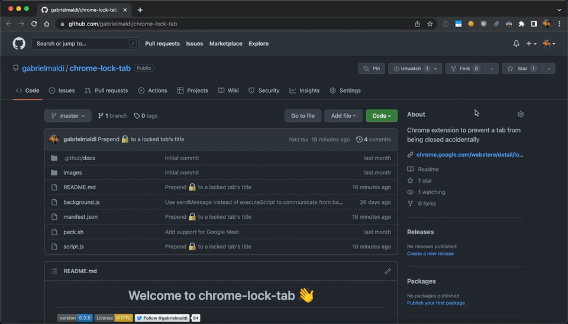

<h1 align="center">Welcome to chrome-lock-tab 👋</h1>

  
  
  

> Chrome extension to prevent a tab from being closed accidentally

## Installation

Install from the [Chrome Web Store](https://chrome.google.com/webstore/detail/lock-tab/nhbdiieigbgalknjplfpgmjnpbnkchnb) or clone this repo and [load the extension](https://developer.chrome.com/docs/extensions/mv3/getstarted/#unpacked).

## Usage

Pin the extension and then click to toggle.

## Author

👤 **Gabriel Monteagudo**

* Website: https://booster.software 🚂
* Twitter: [@gabrielmaldi](https://twitter.com/gabrielmaldi)
* Github: [@gabrielmaldi](https://github.com/gabrielmaldi)
* LinkedIn: [@gabrielmaldi](https://linkedin.com/in/gabrielmaldi)

## Show your support

Give a ⭐️ if this project helped you!

## 📝 License

Copyright © 2022 [gabrielmaldi](https://github.com/gabrielmaldi). 
This project is [WTFPL](http://www.wtfpl.net/about/) licensed.

***
_This README was generated with ❤️ by [readme-md-generator](https://github.com/kefranabg/readme-md-generator)_
